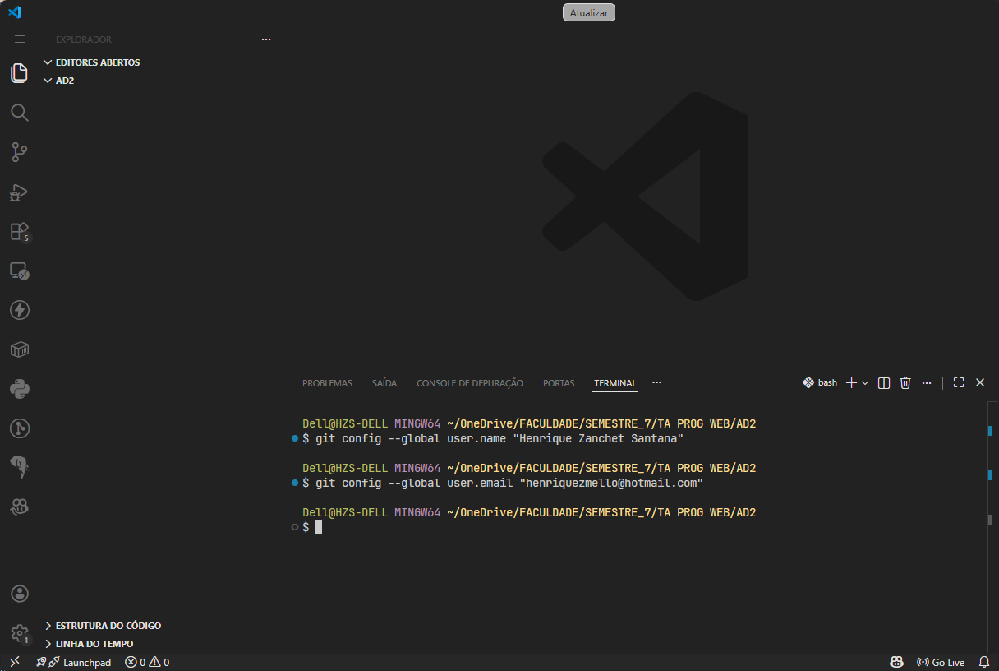
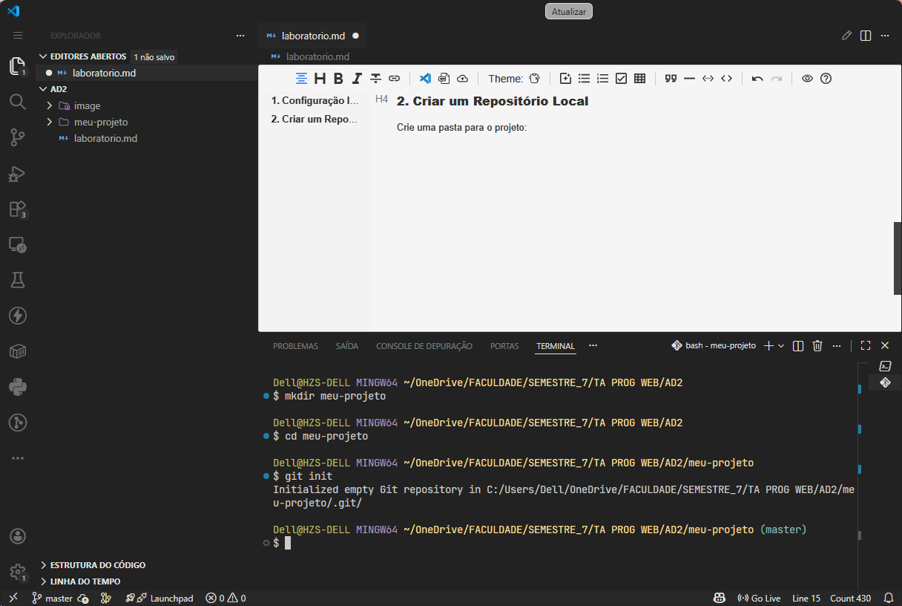
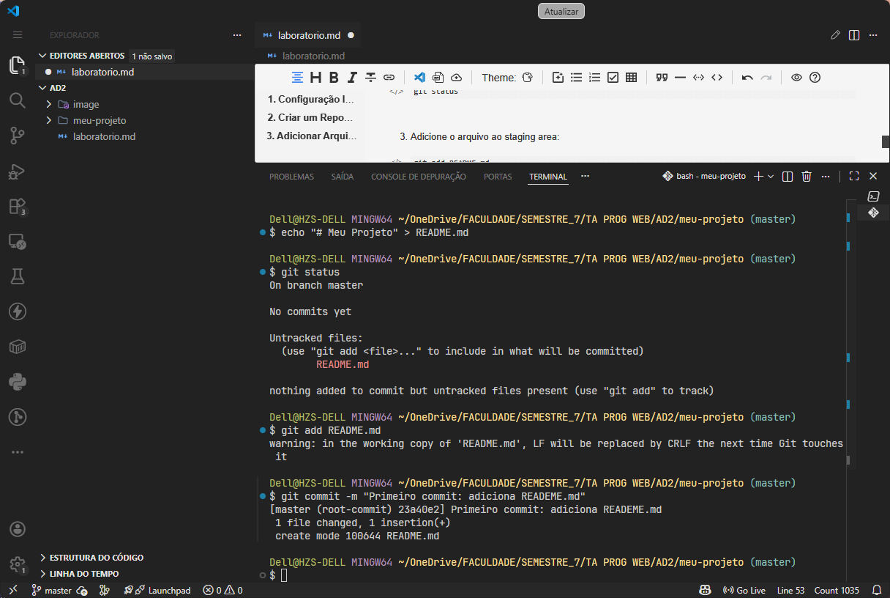
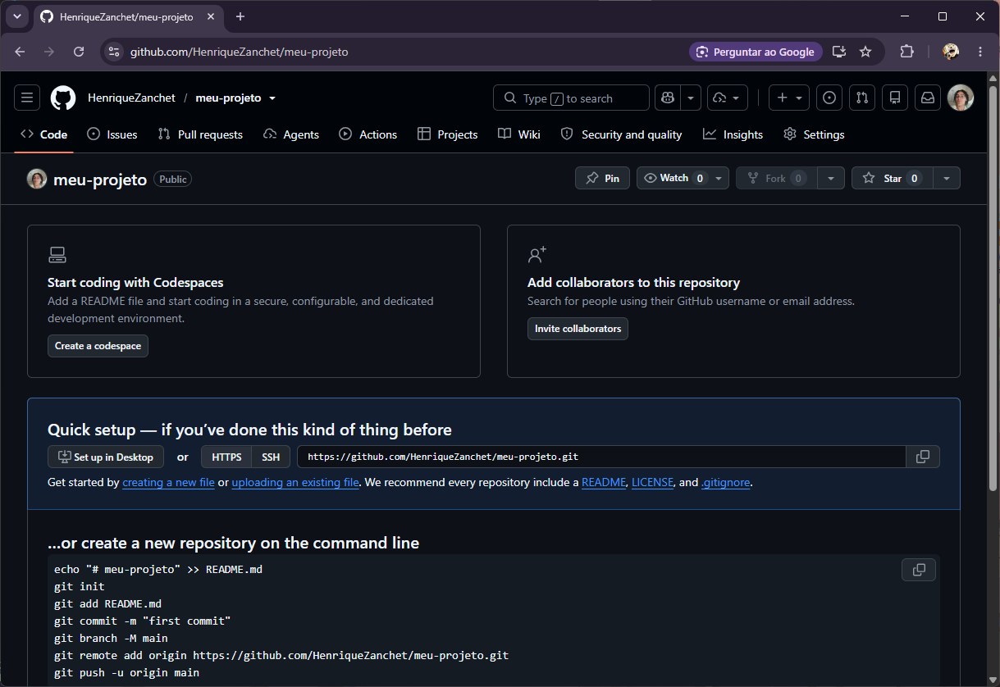
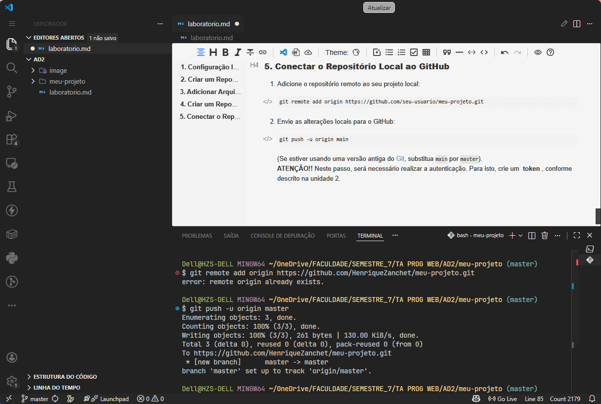
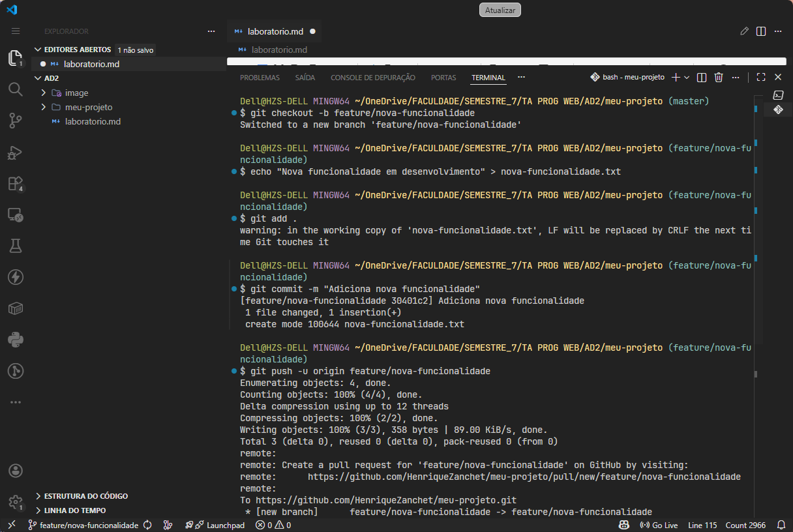
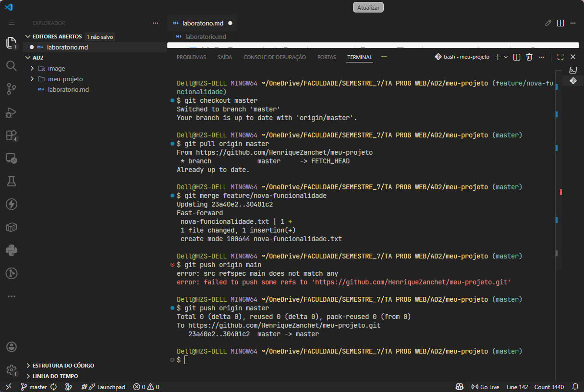

# Laboratório

## Print 1

Configuração inicial do Git no terminal do VS Code.

## Print 2

Criação da pasta do projeto e inicialização do repositório local.

## Print 3

Adição do arquivo README, verificação do status e primeiro commit.

## Print 4

Página do repositório no GitHub com as instruções de quick setup.

## Print 5

Conexão do repositório local ao GitHub e envio das alterações.

## Print 6

Criação da branch de nova funcionalidade, commit e push da branch.

## Print 7

Retorno para a branch principal, merge da funcionalidade e push final.

